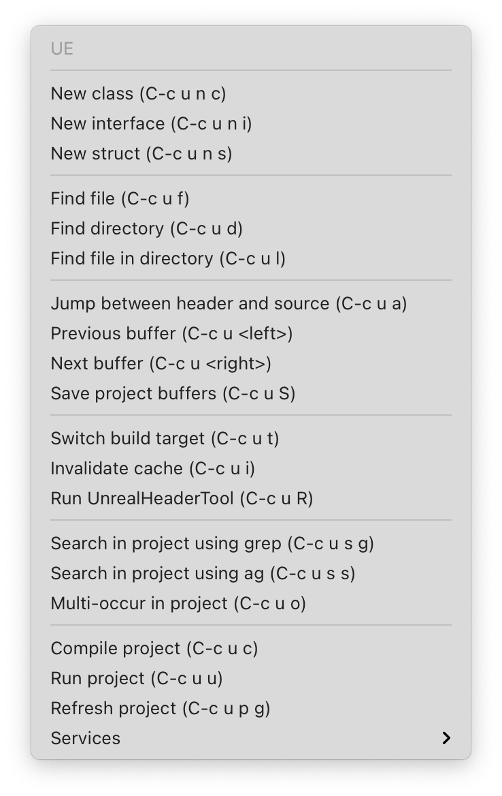

= ue.el
:toc:
// Enable experimental attribute to support kbd macro.
:experimental:
// Names
:project-name: pass:normal[`ue.el`]
// URIs
:uri-ag: https://github.com/Wilfred/ag.el
:uri-grep: https://www.gnu.org/software/grep/
:uri-magit: https://magit.vc/
:uri-multi-occur: https://www.emacswiki.org/emacs/OccurMode#h5o-10
:uri-plugin: https://gitlab.com/unrealemacs/emacs-sourcecode-access
:uri-projectile-commands: https://docs.projectile.mx/projectile/usage.html#interactive-commands
:uri-projectile: https://github.com/bbatsov/projectile
:uri-rg: https://github.com/dajva/rg.el
:uri-ripgrep: https://github.com/BurntSushi/ripgrep
:uri-the-silver-searcher: https://github.com/ggreer/the_silver_searcher
:uri-yasnippet: https://github.com/joaotavora/yasnippet
:uri-melpa: https://melpa.org/#/
:uri-use-package: https://github.com/jwiegley/use-package
:uri-example-emacs-config: https://gitlab.com/unrealemacs/emacsconfig

== Abstract

The  {project-name} provides  a  minor mode  for  working with  Unreal
Engine projects in GNU  Emacs.  It complements the {uri-plugin}[Unreal
Editor plug-in] and uses project files it generates.

This is a work in progress project.

== Copyright Notice

....
Copyright 2021 Oleksandr Manenko

This  program is  free  software: you  can  redistribute it  and/or
modify it  under the  terms of  the GNU  General Public  License as
published by the Free Software  Foundation, either version 3 of the
License, or (at your option) any later version.

This program is distributed in the hope that it will be useful, but
WITHOUT  ANY  WARRANTY;  without   even  the  implied  warranty  of
MERCHANTABILITY or FITNESS  FOR A PARTICULAR PURPOSE.   See the GNU
General Public License for more details.

You should have  received a copy of the GNU  General Public License
along      with      this      program.       If      not,      see
<https://www.gnu.org/licenses/>.
....

== Features

The  {project-name}  is   based  on  {uri-projectile}[Projectile]  and
extends it with Unreal Engine projects support.

It  supports  almost  all  Projectile features  except  debugging  and
testing. There are plans to add these features in the future.

It also installs a few snippets  specific to Unreal Engine and enables
syntax highlighting of its reflection attributes and macros in the C++
code.

=== Unreal Engine Project Management

In short, you can:

- Compile Unreal Engine projects.
- Run Unreal Engine projects.
- Switch between build configurations.
- Run `UnrealHeaderTool` to refresh the code it generates.
- Jump to a file in a project.
- Jump to files at point in a project.
- Jump to a directory in a project.
- Jump to a file in a directory.
- Jump to a project buffer.
- Jump between source and header files of the same class.
- Kill all project buffers.
- Save all project buffers.
- Multi-occur in project buffers.
- Grep in a project.
- etc.

The {project-name} makes  it more convenient to work  on Unreal Engine
projects in Emacs.  Refer to the <<user-content-interactive-commands>>
section to get a full list of commands available to you.

=== Enhanced Syntax Highlighting

The following reflection attributes are highlighted by default:

- `UCLASS`
- `UDELEGATE`
- `UENUM`
- `UFUNCTION`
- `UINTERFACE`
- `UMETA`
- `UPARAM`
- `UPROPERTY`
- `USTRUCT`

These macros are also highlighted by default:

- `GENERATED_BODY`
- `GENERATED_IINTERFACE_BODY`
- `GENERATED_UCLASS_BODY`
- `GENERATED_UINTERFACE_BODY`
- `GENERATED_USTRUCT_BODY`

You  can   configure  the   faces  for   attributes  and   macros  via
`ue-attribute-face` and `ue-generated-body-macro-face` variables. Both
of them are set to `font-lock-preprocessor-face` by default.

=== Snippets

The  package  activates a  few  Unreal  Engine  snippets if  you  have
{uri-yasnippet}[yasnippet] installed.  More snippets  will be added in
the future.

==== UPROPERTY

|=====================================================================
| Key | Description
|`upc`| Component `UPROPERTY`
|`upe`| `UPROPERTY(EditDefaultsOnly)`
|`ups`| `TSubclassOf UPROPERTY`
|`upv`| `UPROPERTY(VisibleEverywhere)`
|=====================================================================

==== UFUNCTION

|=====================================================================
| Key | Description
|`uff`| `UFUNCTION(BlueprintCallable)`
|`ufp`| `UFUNCTION(BlueprintPure)`
|=====================================================================

==== Logging

|=====================================================================
| Key | Description
|`uld`| Declare a custom log category (use it in a header file)
|`uli`| Implement a custom log category (use it in a source file)
|`ull`| Write a message to the log
|=====================================================================

==== Events

Every event snippet uses the same mnemonic rules:

....
 +--- Operation
 |    i-mplement event handler
 |    d-eclare event handler
 |    s-ubscribe to event
 V
uioncomponentbeginoverlap
^ ^                     ^
| |     Event Name      |
| +---------------------+
|
+-- Every ue.el snippet starts with 'u'.
....

The  following event  snippets available  at the  moment and  more are
coming in the future:

|=====================================================================
| Key                       | Description
|`udoncomponentbeginoverlap`| Declare `OnComponentBeginOverlap` event
handler
|`uioncomponentbeginoverlap`| Implement `OnComponentBeginOverlap`
event handler
|`usoncomponentbeginoverlap`| Subscribe to `OnComponentBeginOverlap`
event
|=====================================================================

==== Misc

The  following   snippets  reduce  typing  needed   for  commonly-used
functions and macro.

|=====================================================================
| Key   | Description
|`ucds` | `CreateDefaultSubobject`
|`utext`| `TEXT()`
|=====================================================================

=== Mode Line

The  package adds  an indicator  of the  current build  target to  the
mode-line:

....
ue[MyProjectEditor-Mac-DebugGame]
....

If there is no build target set, the mode line looks like this:

....
ue[?]
....

You  can click  on the  mode-line  to invoke  a menu  of the  commands
available:

== Installation

The {project-name} is available on the major community maintained repo
– {uri-melpa}[MELPA].

=== package.el

The `package.el` is the built-in package manager in Emacs.

`M-x` `package-install` `[RET]` `ue` `[RET]`

Then add the following lines to your Emacs config:

[source,elisp]
----
(require 'ue)
(define-key ue-mode-map (kbd "C-c u") 'ue-command-map)
(ue-global-mode +1)
----

=== use-package.el

The  {uri-use-package}[`use-package.el`]  is   a  declarative  way  of
expressing package configuration in Emacs.

[source,elisp]
----
(use-package ue
  :init   (ue-global-mode +1)
  :config (define-key ue-mode-map (kbd "C-c u") 'ue-command-map))
----

=== Manual

Clone the project:

....
$ mkdir -p ~/Documents/Projects/UnrealEmacs
$ cd ~/Documents/Projects/UnrealEmacs
$ git clone git@gitlab.com:unrealemacs/ue.el.git ue
....

Add the cloned directory to Emacs `load-path` in your `init.el` file:

[source,elisp]
----
(add-to-list 'load-path "~/Documents/Projects/UnrealEmacs/ue")
----

Then in the `init.el`:

[source,elisp]
----
(require 'ue)
(define-key ue-mode-map (kbd "C-c u") 'ue-command-map)
(ue-global-mode +1)
----

== Configuration

The {project-name} has no default prefix  set for its commands. To set
it to  kbd:[C-c u] add  the following  lines to your  `init.el` before
activating `ue-global-mode`:

[source,elisp]
----
(define-key ue-mode-map (kbd "C-c u") 'ue-command-map)
----

You   can   also  refer   to   {uri-example-emacs-config}[EmacsConfig]
repository which  provides an opionated Unreal  Emacs configuration by
integrating a few packages together. It has the following features:

- Autocompletion via  `lsp` and `clangd` using  the database generated
by {uri-plugin}[Unreal Editor plug-in].
- Unreal Engine project management via `ue.el`.
- Snippets via `yasnippet`.
- Code formatting via `clang-format`.
- Code quality analysis via `flycheck`.
- And more.

== Usage

The   `ue-mode`    activates   for    projects   generated    by   the
{uri-plugin}[Unreal Editor  plug-in], which means you  should have the
plug-in  installed  and enabled;  the  project  files generated.   The
workflow is the same as for  any other IDE/editor that has integration
with Unreal Engine.

=== Interactive Commands

Almost   all    Projectile   {uri-projectile-commands}[commands]   are
available  to you  as  usual. However,  {project-name}  defines a  few
Unreal Engine  specific commands, changes  behavior of a  few built-in
Projectile  commands,  and   binds  them  to  its  own   key  map  for
convenience.

==== Commands

[[ue-jump-between-header-and-implementation,`ue-jump-between-header-and-implementation`]]`ue-jump-between-header-and-implementation`::
Jump between class header and source files.

[[ue-switch-to-buffer,`ue-switch-to-buffer`]]`ue-switch-to-buffer`::
Display a list of all project buffers currently open.

[[ue-compile-project,`ue-compile-project`]]`ue-compile-project`::
Compile the project  for current build target.  If there  is no target
set, prompt a user to select one and then compile the project.

[[ue-find-dir,`ue-find-dir`]]`ue-find-dir`::
Display  a list  of all  directories in  the project.   With a  prefix
argument it will clear the cache first.

[[ue-dired,`ue-dired`]]`ue-dired`::
Open the root of the project in dired.

[[ue-recentf,`ue-recentf`]]`ue-recentf`::
Show a list of recently visited project files.

[[ue-edit-dir-locals,`ue-edit-dir-locals`]]`ue-edit-dir-locals`::
Open the root `.dir-locals.el` of the project.

[[ue-find-file,`ue-find-file`]]`ue-find-file`::
Display a list of all files in the project.  With a prefix argument it
will clear the cache first.

[[ue-find-file-dwim,`ue-find-file-dwim`]]`ue-find-file-dwim`::
Jump to a  project's files using completion based on  context.  With a
prefix  argument  invalidates  the  cache  first. If  point  is  on  a
filename, {project-name}  first tries to  search for that file  in the
project:

- If it finds  just a file, it switches to  that file instantly.  This
works even  if the filename is  incomplete, but there's only  a single
file in the current project that matches the filename at point.

- If it finds a list of files, the list is displayed for selecting.  A
list of  files is displayed when  a filename appears more  than one in
the project  or the  filename at point  is a prefix  of more  than two
files in the project.

- If  it finds  nothing,  the list  of  all files  in  the project  is
  displayed for selecting.

[[ue-invalidate-cache,`ue-invalidate-cache`]]`ue-invalidate-cache`::
Invalidate the project cache (if existing).

[[ue-find-file-in-directory,`ue-find-file-in-directory`]]`ue-find-file-in-directory`::
Display a list  of all files in a directory  (that’s not necessarily a
project).

[[ue-multi-occur,`ue-multi-occur`]]`ue-multi-occur`::
Run {uri-multi-occur}[multi-occur]  on all project  buffers currently
open.

[[ue-uht-project,`ue-uht-project`]]`ue-uht-project`::
Run UnrealHeaderTool  on the project.  Use this option  to synchronize
generated files with your changes in the project's header files.

[[ue-grep,`ue-grep`]]`ue-grep`::
Run {uri-grep}[grep] on the files in the project.

[[ue-ripgrep,`ue-ripgrep`]]`ue-ripgrep`::
Run  {uri-ripgrep}[ripgrep]  on  the  project,  performing  a  literal
search.   Requires {uri-rg}[rg.el]  to  be installed.   With a  prefix
argument it will perform a regex search.

[[ue-ag,`ue-ag`]]`ue-ag`::
Run  {uri-the-silver-searcher}[the_silver_searcher]  aka `ag`  on  the
project, performing  a literal search. Requires  {uri-ag}[ag.el] to be
installed.  With a prefix argument it will perform a regex search.

[[ue-save-project-buffers,`ue-save-project-buffers`]]`ue-save-project-buffers`::
Save all project buffers.

[[ue-switch-build-target,`ue-switch-build-target`]]`ue-switch-build-target`::
Select a build target for the current project.

[[ue-run-project,`ue-run-project`]]`ue-run-project`::
Run the project using the current build target.  If there is no target
set, prompt a user to select one and then run the project.

[[ue-version-control-status,`ue-version-control-status`]]`ue-version-control-status`::
Open version  control status window at  the root of the  project.  For
git projects `magit-status-internal` is  used if {uri-magit}[Magit] is
available.

[[ue-previous-project-buffer,`ue-previous-project-buffer`]]`ue-previous-project-buffer`::
Switch to the previous project buffer.

[[ue-next-project-buffer,`ue-next-project-buffer`]]`ue-next-project-buffer`::
Switch to the next project buffer.

==== Keybindings

The {project-name} has no default prefix  set for its commands but all
examples in the  manual assume you have chosen kbd:[C-c  u].  Refer to
the <<user-content-configuration>>  section to learn how  to configure
the prefix.

|=====================================================================
|Key                 | Binding
|kbd:[C-c u a]       | <<ue-jump-between-header-and-implementation>>
|kbd:[C-c u b]       | <<ue-switch-to-buffer>>
|kbd:[C-c u c]       | <<ue-compile-project>>
|kbd:[C-c u d]       | <<ue-find-dir>>
|kbd:[C-c u D]       | <<ue-dired>>
|kbd:[C-c u e]       | <<ue-recentf>>
|kbd:[C-c u E]       | <<ue-edit-dir-locals>>
|kbd:[C-c u f]       | <<ue-find-file>>
|kbd:[C-c u g]       | <<ue-find-file-dwim>>
|kbd:[C-c u i]       | <<ue-invalidate-cache>>
|kbd:[C-c u l]       | <<ue-find-file-in-directory>>
|kbd:[C-c u o]       | <<ue-multi-occur>>
|kbd:[C-c u R]       | <<ue-uht-project>>
|kbd:[C-c u s g]     | <<ue-grep>>
|kbd:[C-c u s r]     | <<ue-ripgrep>>
|kbd:[C-c u s s]     | <<ue-ag>>
|kbd:[C-c u S]       | <<ue-save-project-buffers>>
|kbd:[C-c u t]       | <<ue-switch-build-target>>
|kbd:[C-c u u]       | <<ue-run-project>>
|kbd:[C-c u v]       | <<ue-version-control-status>>
|kbd:[C-c u <left>]  | <<ue-previous-project-buffer>>
|kbd:[C-c u <right>] | <<ue-next-project-buffer>>
|=====================================================================
